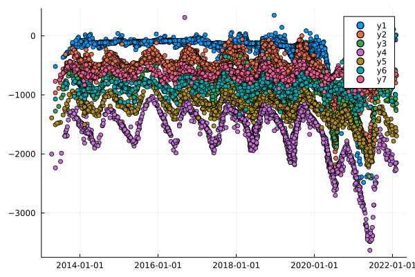
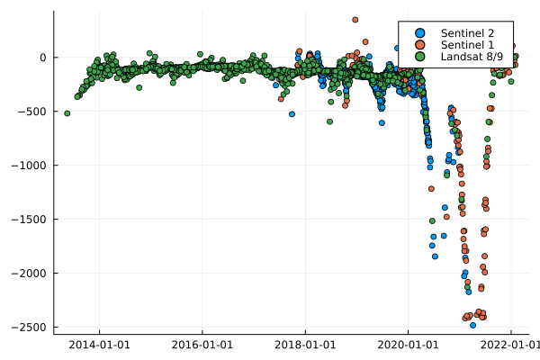

[](https://alex-s-gardner.github.io/ItsLive.jl/dev)


# ItsLive.jl
# A Julia Package 
**This repository is the beginnings of a Julia package for working with NASA [ITS_LIVE](https://its-live.jpl.nasa.gov/) data, it is in its infancy and will be developed over time**

Satellite observations can reveal how the world’s glaciers have responded to recent changes in climate, and can inform predictions of future sea level rise. To enable the next generation of ice sheet models and process-based studies, ITS_LIVE provides a decades-long, high-resolution record of global ice velocity and elevation change. The cloud-based ITS_LIVE architecture continually processes and synthesizes new data from multiple optical, radar, and laser satellite sensors, resulting in a high-resolution, low-latency product that can be used for scientific studies within days of data collection.

## Installation

The package can be installed with the Julia package manager.
From the Julia REPL, type `]` to enter the Pkg REPL mode and run:

```
pkg> add ItsLive
```
```julia
julia> using ItsLive
```

Or, equivalently, via the `Pkg` API:

```julia
julia> import Pkg; Pkg.add("ItsLive")
julia> using ItsLive
```

## Quick start
Load packages [after package has been added]
```julia
using ItsLive
```
Load ITS_LIVE datacube catalog
```julia
catalogdf = ItsLive.catalog()
```
Specify points of interest
```julia
lat = [59.925, 60.048, 60.083, 60.125, 60.168, 60.213, 60.256]
lon = [-140.620, -140.515, -140.467, -140.438, -140.432, -140.387, -140.331]
```
List variable names to retrive
```julia
varnames = ["mid_date", "date_dt", "vx", "vx_error", "vy", "vy_error","satellite_img1"]
```
Retrieve data
```julia
C = ItsLive.getvar(lat,lon,varnames, catalogdf)
```

Plot a single variable for all points
```julia
ItsLive.plotvar(C,"vx")
```


Plot a single point, single variable colored by sensor
```julia
ItsLive.plotbysensor(C[1,:],"vx"); 
```


## Examples
**`example_datacube_workflow.jl`** example script showing how to work with the `ItsLive.jl` package.

**`datacube_basic_pluto.jl`** A simple Pluto example that uses the `ItsLive.jl` package to retrieve and plot ITS_LIVE data.

## Function List 
**`catalogdf = ItsLive.catalog()`** return a DataFrame of the catalog for all of the ITS_LIVE zarr datacubes.

**`rownumdf = ItsLive.intersect(lat, lon, catalogdf)`** return the `rownumber` of the the DataFrame catalog (`catalogdf`) of the ITS_LIVE zarr datacubes that intersects the provided `lat`itude and `lon`gitude.

**`x, y = ItsLive.nearestxy(lat, lon, DataArray)`** return the `x`/`y` indices into a ZarrGroup (`DataArray`) for the points nearest the provided `lat`itude, `lon`gitude locations.

**`C = ItsLive.getvar(lat, lon, varnames, catalogdf)`** return a named m x n matrix of vectors with m = length(`lat`) rows and n = length(`varnames`)+2(for `lat` and `lon`) columns for the points nearest the `lat`/`lon` location from ITS_LIVE Zarr datacubes (`catalogdf`).

**`plotvar(C, varname))`** plot ITS_LIVE data (`C`) variable (`varname`) for multiple points. Use keyword `dtmax` = Number to limit longer image-pair separations from being plotted.

**`plotbysensor(C, varname))`** plot ITS_LIVE data (`C`) variable (`varname`) by sensor. Size(`C`,2) must = 1, e.g. `C[1,:]` of full matrix. Use keyword `dtmax` = Number to limit longer image-pair separations from being plotted.

**`binstats(x, y, [binedges = [0.0], dx= 0, method = "mean"])`** return statistics of `x` central value and `x` spread according to `method` ["mean" = default] argument on values binned by `y`.

**`dtmax = dtfilter(x,dt)`** return the maximum `dt` for which the distribution of `x` show no statistical difference from the distribution of `x` in the minimum `dt` bin

This filter is needed to identify longer dts that exhibit "skipping" or "locking" behavior in feature tracking estimates of surface flow. This happens when the surface texture provides a lesser match than to stationary features, due to long time separation between repeat images, such as ice falls and curved medial moraines.

**`outlier, dtmax, sensorgroups = ItsLive.vxvyfilter(x,dt)`** applies `dtfilter()` to `vx` and `vy` projected on the their median vector and returns `outlier` BitVector, the maximum `dt` (`dtmax`) for which the distribution of vx *or* vy shows no statistical difference and the sensor groupings used when filtering the data (`sensorgroups`).

**`t_fit, v_fit, amp_fit, phase_fit, v_fit_err, amp_fit_err, fit_count, fit_outlier_frac, outlier = ItsLive.lsqfit_annual(v,v_err,mid_date,date_dt,mad_thresh)`** error wighted model fit to discrete interval data. The current model is an iterative fit to a sinusoidal function with unique mean (`v_fit`), phase (`phase_fit`) and amplitude (`amp_fit`) for each year of data centered at time `t_fit`. Errors are provided for annual means (`v_fit_err`) and amplitude (`amp_fit_err`). `fit_count` gives the number of velocity observations used for each year,  `fit_outlier_frac` provides the fraction of data excluded from the model fit and a `outlier` BitVector. 

**`v_i, v_i_err = ItsLive.lsqfit_interp(t_fit, v_fit, amp_fit, phase_fit, v_fit_err, amp_fit_err, t_i)`** evaluates the outputs of `lsqfit` at times `t_i`, outputting velocity (`v_i`) and velocity error (`v_i_err`) at times `t_i`.

**`v0 = ItsLive.running_mean(v, w)`** calculates the running mean of `v` with window size of `w`.

**`offset, slope, error = ItsLive.wliearfit(t, v, v_err, datetime0)`** returns the `offset`, `slope`, and  error (`error`) for a weighted linear fit to `v` with a y-intercept of `datetime0`.

 **`v, v,_err, dv_dt, v_amp, v_amp_err, v_phase = ItsLive.climatology_magnitude(vx0, vy0, vx0_err, vy0_err, dvx_dt, dvy_dt, vx_amp, vy_amp, vx_amp_err, vy_amp_err, vx_phase, vy_phase)`** returns the mean (`v`), standard error (`v_err`), trend (`dv_dt`), seasonal amplitude (`v_amp`), error in seasonal amplitude (`v_amp_err`), and seasonal phase (`v_phase`) from component values projected on the unit flow vector defined by vx0 and vy0.
